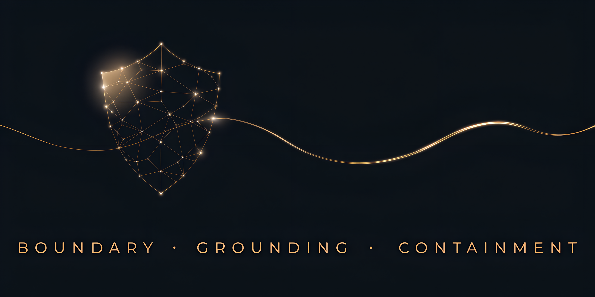

<h3 align="center">I build AI systems that work in production. Then I try to break them.</h3>

  <a href="https://niiosalabs.com">niiosalabs.com</a> ·
  <a href="https://www.linkedin.com/in/michaelofeor">LinkedIn</a> ·
  <a href="https://pypi.org/project/cocoa-plant-detector">PyPI</a>

---

AI Security Architect at **NiiOsa Labs**. 16+ years of telecom infrastructure at MTN Ghana behind me: 20M+ subscribers, 2,000+ sites, systems that were not allowed to fail.

build → attack → understand what failed → harden → test again

**Shipped and running:**
- Voice AI on a tier-1 bank's phone lines. Sub-second latency, 10 live SIP trunks, red-teamed with 31 prompt injection vectors.
- NLP automation at 99.5% uptime. ML engine at 10,000+ predictions/day.
- YOLOv8 package on PyPI.

**Three failure domains. How I think about AI security:**

| **Boundary** | Where trusted and untrusted inputs meet |
|---|---|
| **Grounding** | How the system decides what to trust |
| **Containment** | What the AI can do when things go wrong |

I write about attacking and hardening real systems weekly in **[The Two-Front War](https://www.linkedin.com/build-relation/newsletter-follow?entityUrn=7433140909464027137)**.
